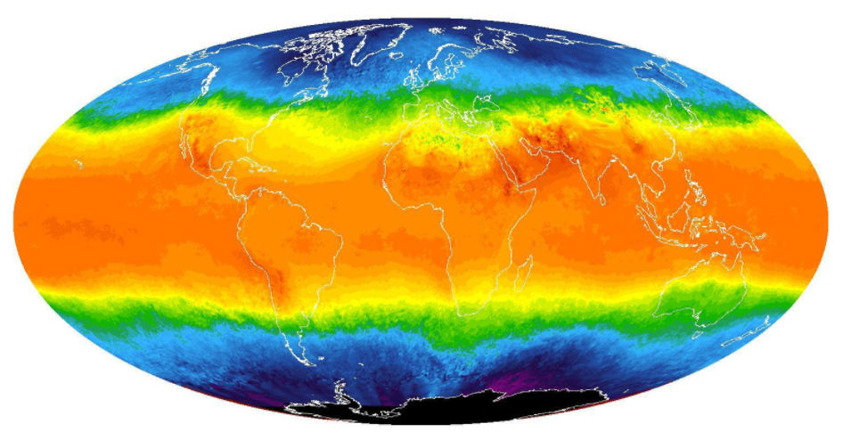

# udacity-dand-projects

This repository contains the projects of the Udacity's [Data Analyst nanodegree](https://www.udacity.com/course/data-analyst-nanodegree--nd002) program through Bertelsmann Scholarship Challenge.

* [Project 1: Explore Weather trends](p1_explore_weather_trends) analyzes local and global temperature data and compare the temperature trends where you live to overall global temperature trends.
 

* [Project 2: Investigate a dataset](p2_investigate_a_dataset) analyzes a dataset and then communicates the findings.

* [Project 3: Analyze A/B test results](p3_analyze_AB_test_results) understands the results of an A/B test run by an e-commerce website.

* [Project 4: Wrangle and Analyze Data](p4_wrangle_and_analyze_data) wrangles and analyzes the tweet data of WeRateDogs that rates people's dogs with a humorous comment about the dog.

* [Project 5: Communicate Data Findings](p5_communicate_data_findings)

