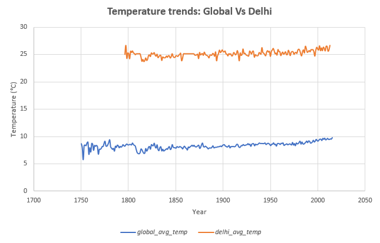
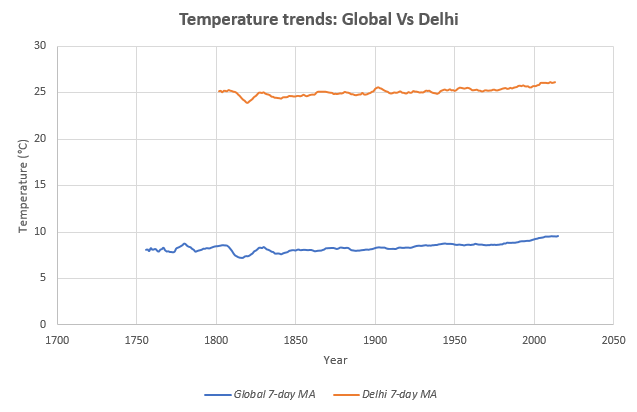
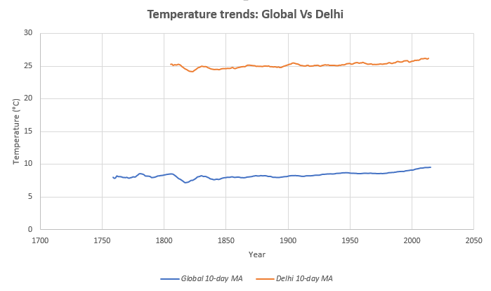

# Explore Weather trends

## Questions answered

1. What tools did you use for each step? (Python, SQL, Excel, etc)?

    Used SQL to extract data from database:

    ```
    SELECT * FROM global_data;
    SELECT city FROM city_list WHERE country = 'India';
    SELECT year, avg_temp FROM city_data WHERE country = 'India' and city = 'Delhi';
    ```

    Used Excel for analysis.

2. How did you calculate the moving average?

    Filled missing values with median.  
    Using `=average(cell2:cell8)` for 7-day average and `=average(cell2:cell12)` for 10-day average and dragging the last value.

3. What were your key considerations when deciding how to visualize the trends?
    
    That `Year` is plotted on the x-axis and `Temperature` on y-axis.  
    Everything is labeled: legends and title.  
    The moving average is plotted to better visualize the trend in temperature.  
    The figures are not too cluttered and show the graph beautifully.
    
## Visualization

**Chart 1:** Average temperature trends: Global Vs Delhi


**Chart 2:** 7-day moving average temperature trends: Global Vs Delhi


**Chart 3:** 10-day moving average temperature trends: Global Vs Delhi

    
    
**Observations:**

* Delhi has higher temperature compared to the global average temperature.
* It's quite evident from the graphs that the world is getting hotter.

Consider the below changes in the observations from the data to confirm this trend:

|  Year Change     | Change in global avg temp | Change in Delhi avg temp | Change in Global 10-day MA | Change in Delhi 10-day MA |
|------------|---------------------------|--------------------------|----------------------------|---------------------------|
|  1810-1850 | 6.92 -> 7.9 = +0.98       | 25.14 -> 24.78 = -0.35   | 8.141 -> 7.988 = -0.15     | 25.182 -> 24.652 = -0.53  |
| 1850-1900  | 7.9 -> 8.5 = +0.60        | 24.78 -> 25.56 = +0.78   | 7.988 -> 8.204 = +0.22     | 24.652 -> 25.209 = +0.56  |
| 1900-1950  | 8.5 -> 8.58 = +0.08       | 25.56 -> 25.53 = -0.03   | 8.204 -> 8.688 = +0.48     | 25.209 -> 25.361 = +0.15  |
| 1950-2000  | 8.58 -> 9.2 = +0.62       | 25.53 -> 26.05 = +0.52   | 8.688 -> 9.153 = +0.46     | 25.361 -> 25.741 = +0.38  |
| 2000-2013  | 9.2 -> 9.61 = +0.41       | 26.05 -> 26.71 = +0.66   | 9.153 -> 9.556 = +0.40     | 25.741 -> 26.146 = +0.40  |

The moving average better captures the trend compared to the average temperature. It can be noted that except in the first 50 years from  1810 to 1850, both global and Delhi's temperature is rising.
