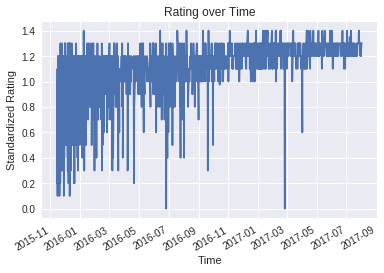
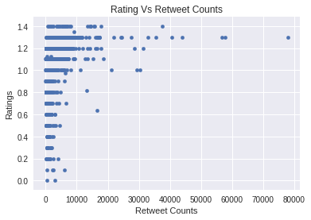
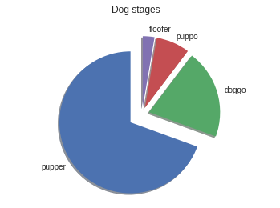
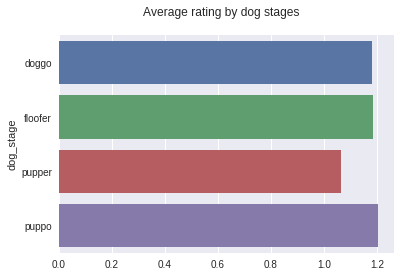
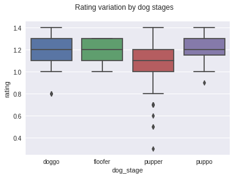
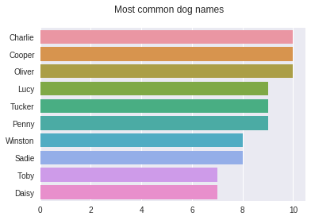
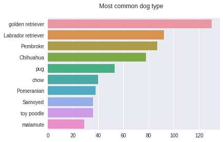

# Wrangle and Analyze Data: `act_report`

## Documentation of analysis and insights
---
## Introduction

The dataset that to be analyzed and visualized is the tweet archive of Twitter user [@dog_rates](https://twitter.com/dog_rates), also known as [WeRateDogs](https://en.wikipedia.org/wiki/WeRateDogs). WeRateDogs is a Twitter account that rates people's dogs with a humorous comment about the dog. These ratings almost always have a denominator of 10. The numerators, though? Almost always greater than 10. 11/10, 12/10, 13/10, etc. Why? Because "[they're good dogs Brent](http://knowyourmeme.com/memes/theyre-good-dogs-brent)." WeRateDogs has over 4 million followers and has received international media coverage.

## Analysis and Visualizations

The following inferences were drawn by analyzing and visualizing the data:

### Favorite Vs Retweet count

There is a positive correlations between favorites and retweet counts.

### Rating over time

The below graph shows that the rating have improved over time. There are very few ratings below 1.0 in 2017 compared to 2016.

### Rating Vs Retweet count

The trend that higher rating yields more retweets isn't consistent as per the below graph.

### Most common dog stages
The most common dog stage is pupper.

### Average rating by dog stages

The highest rated dog stage is puppo.

The below graph shows the variation of rating by dog stages.

### Most common dog names

The most common dog names are Charlie, Cooper, and Oliver.

### Most common dog types

The most common dog type is golden retriever.

### Sample prediction by image prediction model

Consider this dog, Dido, the deep learning model predicts the image correctly as dog and its type.

> This is Dido. She's playing the lead role in "Pupper Stops to Catch Snow Before Resuming Shadow Box with Dried Apple." 13/10 (IG: didodoggo) https://t.co/m7isZrOBX7

Is dog?: True, type: curly-coated retriever, confidence: 0.73, rating: 1.3, favorites: 10914, retweets: 2740

