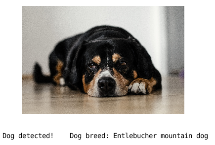
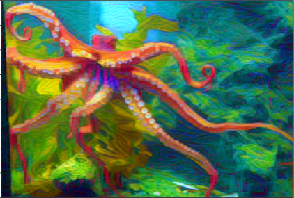

# pytorch-udacity-projects

The notebooks contain the projects of **PyTorch Scholarship Challenge** and [**Deep Learning Nanodegree**](https://www.udacity.com/course/deep-learning-nanodegree--nd101) from Udacity and facebook.

## Project 1: Flower image classification

The [flower_image_classification.ipynb](https://nbviewer.jupyter.org/github/kHarshit/pytorch-projects/blob/master/flower_image_classification.ipynb) contains the project Flower image classifier.
The 102 Category Flower [Dataset](http://www.robots.ox.ac.uk/~vgg/data/flowers/102/index.html) from Visual Geometry Group, University of Oxford, is used.

The following **steps** are described:
* Preprocessing
* Transfer learning
* Saving and loading model checkpoint
* Inference and Validation

**Analysis:**
* Model used: ResNet101
* Epochs trained: 20
* Validation accuracy: 94.13%
* Optimizer used: Adam
* Loss used: CrossEntropyLoss
* Scheduler used: StepLR
* Device used: cuda
* Comments: `fc` layer replacement with combination of linear layers with Dropout regularization 


## Project 2: Dog breed classification

The [dog_breed_classification.ipynb](https://nbviewer.jupyter.org/github/kHarshit/pytorch-projects/blob/master/dog_breed_classification.ipynb) contains the project Dog-Breed Classifier.

The following tasks were completed:

* Detect Humans
* Detect Dogs
* Create a CNN to Classify Dog Breeds (from Scratch)
* Create a CNN to Classify Dog Breeds (using Transfer Learning)



## Project 3: TV Script generation

The [tv_script_generation.ipynb](https://nbviewer.jupyter.org/github/kHarshit/pytorch-projects/blob/master/tv_script_generation.ipynb) contains the project TV Script generation.

* The project uses LSTM.

```
jerry: sittin' watches.
sales woman: oh yeah, that's the one that was.
captain: oh yeah.
elaine: oh, hi.
officer: oh.
elaine: hi.
manager: hi, woah, woah.
sales woman: hi, let's go.
sales woman: alright, let's get it.
jerry:(to george) i don't want to go back to david peterman! i can't believe it!
jerry: hey- what's happening with you!
kramer: hey!
glenn:(to elaine) hey, jerry.
elaine: oh, that's right, i'm gonna get out. i'm starving, and you want to get out of the coma?
captain: well, it's like a liar.
clerk: well, i don't think so.
kramer: well, i think i'd like to be honest with this plane.
elaine:(pointing to jerry) well, it's a lot of pressure.
sales woman:(confused) i think you're a human dumb.
george: well, i think i'm going to have any differently.
sales woman: what do you care about it?
george: yeah, yeah.
elaine: yeah.
helen: i can't find the cooks.
george: well, i think i could be able to be able to be honest in the toilet.
jerry: what is this doorman?
officer: yes.
george: i can't believe this type!
jerry: what? what?
captain: oh, yeah.
sales woman: i am aware.
elaine: well, i don't think i have a problem with a movie.
jerry: oh, my god!
sales woman: hey, jerry?
officer: hey, what's going on here?
sales woman: well, i was terrified- 9 vest.
elaine:(to jerry) i don't think so.
kramer: oh.
mr. ross: i can't.
```

## Project 4: Face Generation using DCGAN

The [face_generation_dcgan.ipynb](https://nbviewer.jupyter.org/github/kHarshit/pytorch-projects/blob/master/face_generation_dcgan.ipynb) contains the project on face generation.

* Model used: DCGAN (Deep Convolutional Generative Adversarial Networks)
  * Discriminator: strided convolution > batch norm > leaky ReLU
  * Generator: transpose convolution > batch norm > ReLU
* Optimizers: Adam
* learning rate: 0.0002
* beta1 = 0.5  *(changed from 0.9)*
* beta2 = 0.999  *(default value)*


## Project 5: Deploying sentiment analysis model on Sagemaker

The [sagemaker_sentiment_analysis.ipynb](https://nbviewer.jupyter.org/github/kHarshit/pytorch-projects/blob/master/sagemaker_sentiment_analysis.ipynb) contains the project Deploying sentiment analysis model in PyTorch on [AWS](https://aws.amazon.com/) using Amazon Sagemaker.


* Download or otherwise retrieve the data.
* Process / Prepare the data.
* Upload the processed data to S3.
* Train a chosen model.
* Test the trained model (typically using a batch transform job).
* Deploy the trained model.
* Use the deployed model for web app.
    * Setting up a Lambda function.
    * Setting up API Gateway.


## Project 6: Neural Style Transfer

The [project](https://github.com/kHarshit/style-transfer) implements Image Style Transfer Using Convolutional Neural Networks following an implementation by *Leon A. Gatys et al*.


  content image            |  style image             | output image
:-------------------------:|:------------------------:|:-------------------------:
 |  | 


