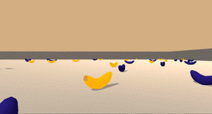

# udacity-drlnd-projects

This repository contains the projects of the Udacity's [Deep Reinforcement Learning](https://www.udacity.com/course/deep-reinforcement-learning-nanodegree--nd893) program.

* [Project 1: Navigation](p1_navigation) is about training a RL agent to navigate (and collect bananas!) in a large, square world. 

* [Project 2: Continuous Control](p2_continuous_control) is about training a RL double-jointed arm agent so that it can move to target locations.

* [Project 3: Collaboration and Competition](p3_collab_compet) is about training two RL agents to control tennis rackets to bounce a ball over a net.  

