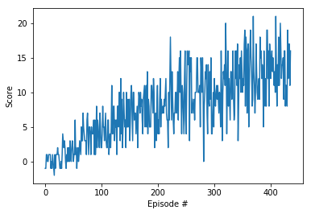

# Project 1: Navigation *Report*

This report summarizes the learning algorithm, and model architecture used to
train a RL agent to navigate (and collect bananas!) in a large, square world.

**Goal:** The goal of training is to allow the agent to receive an average reward (over 100 episodes) of at least +13.

## Learning algorithm

This project uses [Deep Q Network
(DQN)](https://storage.googleapis.com/deepmind-media/dqn/DQNNaturePaper.pdf) to train the agent.

> Here we use recent advances in training deep neural networks to develop a novel artificial agent, termed a deep Q-network, that can learn successful policies directly from high-dimensional sensory inputs using end-to-end reinforcement learning.

### Model architecture

The Deep Q Network has the following architecture having three four connected
layers.

```
QNetwork(
  (fc1): Linear(in_features=37, out_features=64, bias=True)
  (fc2): Linear(in_features=64, out_features=64, bias=True)
  (fc3): Linear(in_features=64, out_features=32, bias=True)
  (fc4): Linear(in_features=32, out_features=4, bias=True)
)
```

### Hyperparameters

The various hyperparameters used are as follows:

```
# hyperparameters

BUFFER_SIZE = int(1e5)  # replay buffer size
BATCH_SIZE = 64         # minibatch size
GAMMA = 0.99            # discount factor
TAU = 1e-3              # for soft update of target parameters
LR = 6e-4               # learning rate
UPDATE_EVERY = 4        # how often to update the network


N_EPISODES = 2000  # number of episodes to run
MAX_T = 1000       # maximum timesteps per episode
EPS_START = 1.0    # start value for epsilon-greedy search
EPS_END = 0.01     # end value for epsilon-greedy search
EPS_DECAY = 0.995  # decay factor for epsilon-greedy search
```

## Training

The training score progress is as shown.

```
Episode 100	Average Score: 1.98
Episode 200	Average Score: 6.54
Episode 300	Average Score: 9.37
Episode 400	Average Score: 11.90
Episode 436	Average Score: 13.04
Environment solved in 336 episodes!	Average Score: 13.04
```



## Future work

* Try different network architecture with varied number of layers, and number of neurons.
* Try different combinations of hyperparameters.
* Use regularization such as dropout in the network.
* Use more advanced Q learning algorithms such as double/dueling DQN.

