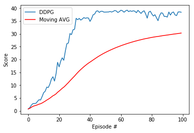

# Project 2: Continuous Control *Report*

This report summarizes the learning algorithm, and model architecture used to
train a RL double-jointed arm agent so that it can move to target locations.

**Goal:** The goal of training is to allow the agent to receive an average reward (over 100 episodes) of at least +30.

## Learning algorithm

This project uses [DDPG (Deep Deterministic Policy Gradient)](https://arxiv.org/pdf/1509.02971.pdf) to train the agent.

> We present an actor-critic, model-free algorithm based on the deterministic policy gradient that can operate over continuous action spaces. Using the same learning algorithm, network architecture and hyper-parameters, our algorithm robustly solves more than 20 simulated physics tasks, including classic problems such as cartpole swing-up, dexterous manipulation, legged locomotion and car driving.

### Model architecture

The Actor and Critic network have the following architectures.

```
---Actor---
Actor(
  (fc1): Linear(in_features=33, out_features=400, bias=True)
  (bn1): BatchNorm1d(400, eps=1e-05, momentum=0.1, affine=True, track_running_stats=True)
  (fc2): Linear(in_features=400, out_features=300, bias=True)
  (fc3): Linear(in_features=300, out_features=4, bias=True)
)
---Critic---
Critic(
  (fcs1): Linear(in_features=33, out_features=400, bias=True)
  (bn1): BatchNorm1d(400, eps=1e-05, momentum=0.1, affine=True, track_running_stats=True)
  (fc2): Linear(in_features=404, out_features=300, bias=True)
  (fc3): Linear(in_features=300, out_features=1, bias=True)
)
```

### Hyperparameters

The various hyperparameters used are as follows:

```
# hyperparameters

BUFFER_SIZE = int(1e6)  # replay buffer size
BATCH_SIZE = 128        # minibatch size
GAMMA = 0.99            # discount factor
TAU = 1e-3              # for soft update of target parameters
LR_ACTOR = 1e-3         # learning rate of the actor
LR_CRITIC = 1e-3        # learning rate of the critic
WEIGHT_DECAY = 0        # L2 weight decay
MAX_T = 1000            # maximum number of timesteps per episode

LEARN_EVERY = 20        # learning timestep interval
LEARN_NUM   = 10        # number of learning passes
GRAD_CLIPPING = 1.0     # Gradient Clipping

# Ornstein-Uhlenbeck noise parameters
OU_SIGMA  = 0.2
OU_THETA  = 0.15
EPSILON = 1.0           # for epsilon in the noise process (act step)
EPSILON_DECAY = 1e-6
```

## Training

The training score progress is as shown.

```
Episode 1 (113s)	Mean: 0.73	Moving Avg: 0.73
Episode 2 (116s)	Mean: 1.23	Moving Avg: 0.98
Episode 3 (118s)	Mean: 2.18	Moving Avg: 1.38
Episode 4 (118s)	Mean: 2.81	Moving Avg: 1.74
Episode 5 (119s)	Mean: 2.85	Moving Avg: 1.96
Episode 6 (119s)	Mean: 2.94	Moving Avg: 2.12
Episode 7 (122s)	Mean: 3.67	Moving Avg: 2.34
Episode 8 (120s)	Mean: 4.34	Moving Avg: 2.59
Episode 9 (122s)	Mean: 4.21	Moving Avg: 2.77
Episode 10 (122s)	Mean: 5.58	Moving Avg: 3.05
Episode 11 (124s)	Mean: 7.08	Moving Avg: 3.42
Episode 12 (124s)	Mean: 7.65	Moving Avg: 3.77
Episode 13 (127s)	Mean: 9.24	Moving Avg: 4.19
Episode 14 (129s)	Mean: 9.09	Moving Avg: 4.54
Episode 15 (129s)	Mean: 10.40	Moving Avg: 4.93
Episode 16 (132s)	Mean: 12.37	Moving Avg: 5.40
Episode 17 (133s)	Mean: 13.27	Moving Avg: 5.86
Episode 18 (136s)	Mean: 11.59	Moving Avg: 6.18
Episode 19 (137s)	Mean: 14.40	Moving Avg: 6.61
Episode 20 (140s)	Mean: 18.89	Moving Avg: 7.23
Episode 21 (144s)	Mean: 17.11	Moving Avg: 7.70
Episode 22 (148s)	Mean: 19.33	Moving Avg: 8.23
Episode 23 (151s)	Mean: 20.65	Moving Avg: 8.77
Episode 24 (154s)	Mean: 19.69	Moving Avg: 9.22
Episode 25 (156s)	Mean: 23.20	Moving Avg: 9.78
Episode 26 (159s)	Mean: 26.14	Moving Avg: 10.41
Episode 27 (161s)	Mean: 26.40	Moving Avg: 11.00
Episode 28 (164s)	Mean: 30.09	Moving Avg: 11.68
Episode 29 (165s)	Mean: 29.67	Moving Avg: 12.30
Episode 30 (168s)	Mean: 31.57	Moving Avg: 12.95
Episode 31 (172s)	Mean: 31.77	Moving Avg: 13.55
Episode 32 (177s)	Mean: 36.02	Moving Avg: 14.26
Episode 33 (179s)	Mean: 35.46	Moving Avg: 14.90
Episode 34 (184s)	Mean: 35.99	Moving Avg: 15.52
Episode 35 (188s)	Mean: 35.32	Moving Avg: 16.08
Episode 36 (190s)	Mean: 35.75	Moving Avg: 16.63
Episode 37 (194s)	Mean: 36.30	Moving Avg: 17.16
Episode 38 (191s)	Mean: 36.01	Moving Avg: 17.66
Episode 39 (198s)	Mean: 36.21	Moving Avg: 18.13
Episode 40 (199s)	Mean: 36.13	Moving Avg: 18.58
Episode 41 (201s)	Mean: 34.82	Moving Avg: 18.98
Episode 42 (206s)	Mean: 35.90	Moving Avg: 19.38
Episode 43 (208s)	Mean: 37.41	Moving Avg: 19.80
Episode 44 (210s)	Mean: 37.68	Moving Avg: 20.21
Episode 45 (212s)	Mean: 38.79	Moving Avg: 20.62
Episode 46 (215s)	Mean: 38.93	Moving Avg: 21.02
Episode 47 (217s)	Mean: 38.31	Moving Avg: 21.39
Episode 48 (219s)	Mean: 38.75	Moving Avg: 21.75
Episode 49 (223s)	Mean: 38.76	Moving Avg: 22.10
Episode 50 (222s)	Mean: 38.42	Moving Avg: 22.42
Episode 51 (220s)	Mean: 38.43	Moving Avg: 22.74
Episode 52 (221s)	Mean: 38.47	Moving Avg: 23.04
Episode 53 (221s)	Mean: 38.50	Moving Avg: 23.33
Episode 54 (219s)	Mean: 38.67	Moving Avg: 23.61
Episode 55 (221s)	Mean: 38.47	Moving Avg: 23.88
Episode 56 (222s)	Mean: 38.71	Moving Avg: 24.15
Episode 57 (220s)	Mean: 39.06	Moving Avg: 24.41
Episode 58 (220s)	Mean: 38.88	Moving Avg: 24.66
Episode 59 (224s)	Mean: 38.28	Moving Avg: 24.89
Episode 60 (220s)	Mean: 38.64	Moving Avg: 25.12
Episode 61 (221s)	Mean: 39.18	Moving Avg: 25.35
Episode 62 (222s)	Mean: 38.94	Moving Avg: 25.57
Episode 63 (221s)	Mean: 38.39	Moving Avg: 25.77
Episode 64 (220s)	Mean: 38.90	Moving Avg: 25.98
Episode 65 (219s)	Mean: 39.21	Moving Avg: 26.18
Episode 66 (223s)	Mean: 38.62	Moving Avg: 26.37
Episode 67 (221s)	Mean: 38.95	Moving Avg: 26.56
Episode 68 (223s)	Mean: 38.71	Moving Avg: 26.74
Episode 69 (225s)	Mean: 38.95	Moving Avg: 26.91
Episode 70 (226s)	Mean: 38.78	Moving Avg: 27.08
Episode 71 (224s)	Mean: 38.20	Moving Avg: 27.24
Episode 72 (225s)	Mean: 39.12	Moving Avg: 27.40
Episode 73 (226s)	Mean: 38.53	Moving Avg: 27.56
Episode 74 (225s)	Mean: 37.91	Moving Avg: 27.70
Episode 75 (224s)	Mean: 38.63	Moving Avg: 27.84
Episode 76 (228s)	Mean: 38.95	Moving Avg: 27.99
Episode 77 (225s)	Mean: 37.76	Moving Avg: 28.12
Episode 78 (225s)	Mean: 36.09	Moving Avg: 28.22
Episode 79 (225s)	Mean: 38.42	Moving Avg: 28.35
Episode 80 (226s)	Mean: 38.78	Moving Avg: 28.48
Episode 81 (224s)	Mean: 37.71	Moving Avg: 28.59
Episode 82 (221s)	Mean: 36.92	Moving Avg: 28.69
Episode 83 (222s)	Mean: 37.42	Moving Avg: 28.80
Episode 84 (221s)	Mean: 36.26	Moving Avg: 28.89
Episode 85 (222s)	Mean: 35.10	Moving Avg: 28.96
Episode 86 (222s)	Mean: 37.07	Moving Avg: 29.05
Episode 87 (223s)	Mean: 38.15	Moving Avg: 29.16
Episode 88 (223s)	Mean: 38.02	Moving Avg: 29.26
Episode 89 (222s)	Mean: 36.74	Moving Avg: 29.34
Episode 90 (222s)	Mean: 36.78	Moving Avg: 29.43
Episode 91 (223s)	Mean: 36.49	Moving Avg: 29.50
Episode 92 (224s)	Mean: 38.46	Moving Avg: 29.60
Episode 93 (223s)	Mean: 37.28	Moving Avg: 29.68
Episode 94 (221s)	Mean: 38.22	Moving Avg: 29.78
Episode 95 (223s)	Mean: 38.48	Moving Avg: 29.87
Episode 96 (222s)	Mean: 37.36	Moving Avg: 29.94
Episode 97 (222s)	Mean: 37.08	Moving Avg: 30.02
Episode 98 (222s)	Mean: 38.49	Moving Avg: 30.10
Episode 99 (222s)	Mean: 38.52	Moving Avg: 30.19
Episode 100 (222s)	Mean: 38.38	Moving Avg: 30.27

Environment solved in 0 episodes!	Average Score: 30.27
```



## Future work

* Try different network architecture with varied number of layers, and number of neurons.
* Try different combinations of hyperparameters.
* Use different learning algorithms such as A3C, PPO (Proximal Policy Optimization), and D4PG (Distributed Distributional Deterministic Policy Gradients).

