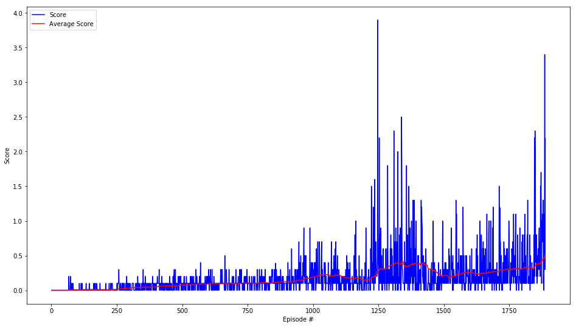

# Project 3: Collaboration and Competition *Report*

This report summarizes the learning algorithm, and model architecture used to train two RL agents control rackets to bounce a ball over a net.

**Goal:** The goal of training is to allow the agent to receive an average reward (over 100 episodes) of at least +0.5.

## Learning algorithm

This project uses **Multi-Agent Deep Deterministic Policy Gradient (MADDPG)**. The paper titled [Multi-Agent Actor-Critic for MixedCooperative-Competitive Environments](https://papers.nips.cc/paper/7217-multi-agent-actor-critic-for-mixed-cooperative-competitive-environments.pdf) is used to multi-agent version of [DDPG](https://arxiv.org/pdf/1509.02971.pdf) to train the agents.

> We present an actor-critic, model-free algorithm based on the deterministic policy gradient that can operate over continuous action spaces. Using the same learning algorithm, network architecture and hyper-parameters, our algorithm robustly solves more than 20 simulated physics tasks, including classic problems such as cartpole swing-up, dexterous manipulation, legged locomotion and car driving.
> &mdash; <cite>DDPG paper</cite>

> We explore deep reinforcement learning methods for multi-agent domains. We then present an adaptation of actor-critic methods that considers action policies of other agents and is able to successfully learn policies that require complex multi-agent coordination.  Additionally, we introduce a training regimen utilizing an ensemble of policies for each agent that leads to more robust multi-agent policies.
> &mdash; <cite>Multi-Agent Actor-Critic paper</cite>

### Model architecture

The Actor and Critic network have the following architectures.

```
---Actor---
Actor(
  (fc1): Linear(in_features=48, out_features=256, bias=True)
  (fc2): Linear(in_features=256, out_features=128, bias=True)
  (fc3): Linear(in_features=128, out_features=2, bias=True)
)
---Critic---
Critic(
  (fcs1): Linear(in_features=48, out_features=256, bias=True)
  (fc2): Linear(in_features=260, out_features=128, bias=True)
  (fc3): Linear(in_features=128, out_features=1, bias=True)
)
```

### Hyperparameters

The various hyperparameters used are as follows:

```
# hyperparameters

BUFFER_SIZE = int(1e6)  # replay buffer size
BATCH_SIZE = 128        # minibatch size
LR_ACTOR = 1e-3         # learning rate of the actor
LR_CRITIC = 1e-3        # learning rate of the critic
WEIGHT_DECAY = 0        # L2 weight decay
LEARN_EVERY = 1         # learning timestep interval
LEARN_NUM = 5           # number of learning passes
GAMMA = 0.99            # discount factor
TAU = 8e-3              # for soft update of target parameters
OU_SIGMA = 0.2          # Ornstein-Uhlenbeck noise parameter, volatility
OU_THETA = 0.15         # Ornstein-Uhlenbeck noise parameter, speed of mean reversion
EPS_START = 5.0         # initial value for epsilon in noise decay process in Agent.act()
EPS_EP_END = 300        # episode to end the noise decay process
EPS_FINAL = 0           # final value for epsilon after decay
N_EPISODES = 4000       # number of episodes
MAX_T = 2000            # maximum number of timesteps per episode
```

## Training

The training score progress is as shown.

```
Episode 1 - 100	Average Score: 0.01	Max Score: 0.200
Episode 101 - 200	Average Score: 0.01	Max Score: 0.100
Episode 201 - 300	Average Score: 0.03	Max Score: 0.300
Episode 301 - 400	Average Score: 0.05	Max Score: 0.300
Episode 401 - 500	Average Score: 0.08	Max Score: 0.300
Episode 501 - 600	Average Score: 0.09	Max Score: 0.400
Episode 601 - 700	Average Score: 0.10	Max Score: 0.500
Episode 701 - 800	Average Score: 0.11	Max Score: 0.300
Episode 801 - 900	Average Score: 0.12	Max Score: 0.390
Episode 901 - 1000	Average Score: 0.19	Max Score: 0.900
Episode 1001 - 1100	Average Score: 0.21	Max Score: 0.700
Episode 1101 - 1200	Average Score: 0.14	Max Score: 1.000
Episode 1201 - 1300	Average Score: 0.36	Max Score: 3.900
Episode 1301 - 1400	Average Score: 0.38	Max Score: 2.500
Episode 1401 - 1500	Average Score: 0.21	Max Score: 1.300
Episode 1501 - 1600	Average Score: 0.26	Max Score: 1.300
Episode 1601 - 1700	Average Score: 0.27	Max Score: 1.200
Episode 1701 - 1800	Average Score: 0.31	Max Score: 1.500
Episode 1887	Average Score: 0.52	Score: 2.190
Environment succesfully solved in 1887 episodes!	Average Score: 0.52

Elapsed Time: 35.47 mins.
```



## Future work

* Try different network architecture with varied number of layers, and number of neurons.
* Try different combinations of hyperparameters.
* Use different learning algorithms such as PPO (Proximal Policy Optimization).
* Use Prioritized Experience Replay to improve performance.

